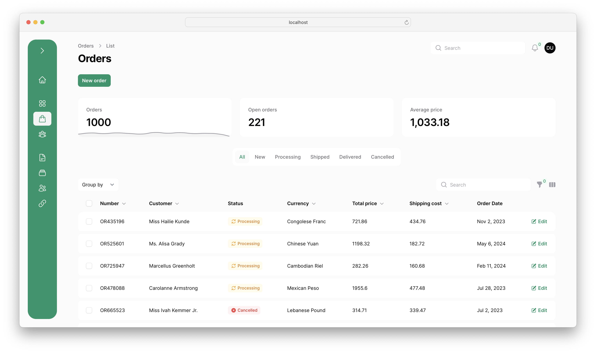
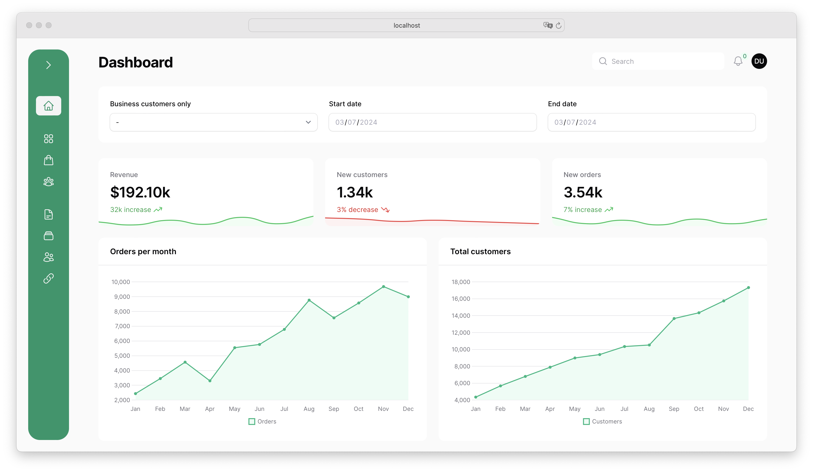
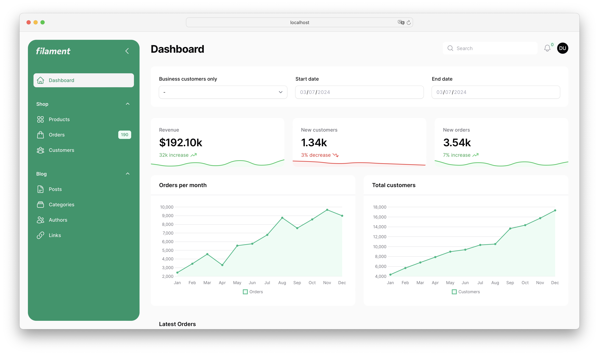
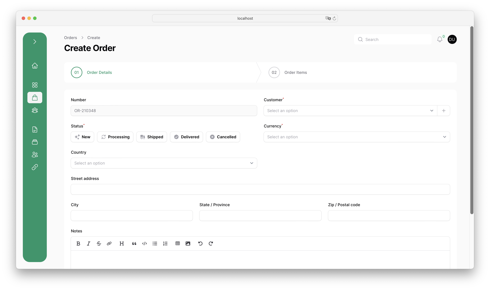
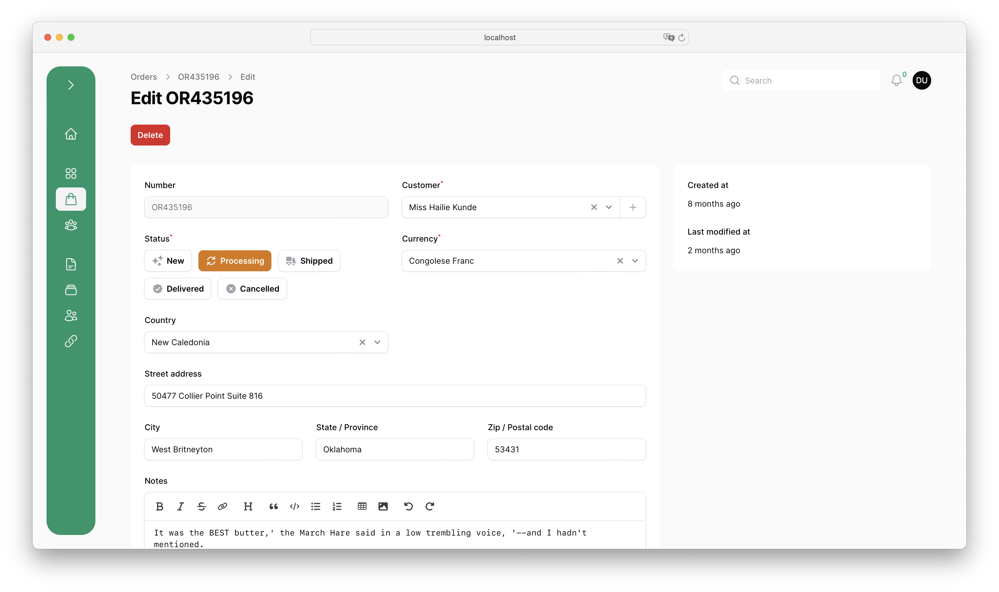

# Filament Harmony Theme
The Filament Harmony Theme is a beautiful and responsive theme for your Filament panel.

## Screenshots






## Installation
Filament Harmony Theme can be installed using our private Composer repository. Configure the repository in your
application's composer.json file:

```json
"repositories": [
  {
    "type": "composer",
    "url": "https://filament-harmony-theme.composer.sh"
  }
]
```

Now you can install the package using:
```bash
composer require angelej/filament-harmony-theme:^3.0
```
You will be prompted to provide a username and password. Use your license email address as username and the license key you received as password.

## Setup

To start using the theme with the Filament Panel Builder, you need to [create a custom theme](https://filamentphp.com/docs/3.x/panels/themes#creating-a-custom-theme).

Next, replace the imported Panel Builder stylesheet with the theme stylesheet in your theme CSS file:

```diff
- @import '/vendor/filament/filament/resources/css/theme.css';
+ @import '/vendor/angelej/filament-harmony-theme/resources/css/index.css';
```
Now compile your theme stylesheet using `npm run build`.

Finally, register the theme plugin in your panel configuration file:
```php
<?php
 
namespace App\Providers\Filament;
 
use Angelej\HarmonyTheme\HarmonyTheme;
use Filament\Panel;
use Filament\PanelProvider;
 
class AdminPanelProvider extends PanelProvider
{
    public function panel(Panel $panel): Panel
    {
        return $panel
            ->plugin(HarmonyTheme::make())
            ->viteTheme('resources/css/filament/admin/theme.css');
    }
}
```